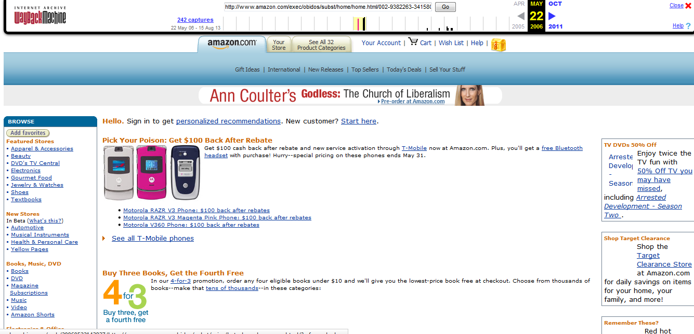

Olivia Coleman 51

# `Week Four Assignment`

## 1. Summary
* I read the assigned chapters in the book and followed along on the class website.
* I learned how to view the code on any website and see how the web page was created.
* I created another `index.html` web page.
* I created a second web page called `definitions.html`.
* I linked the two pages together.
* I looked up a great recipe that I have tried before.
* I tried to include all the semantic markup elements.
* I created this `readme.md` file.
* Here are some screen shots of my work this week:

## 2. Trials and Triumphs
* I feel like I did pretty well with the recipe web page and links.
* It took me a little bit to figure out how to make the definitions page and link it with the first page.

## 3. Going Forward
* It would probably be helpful to work more with creating multiple pages to link together for practice.
* I would also like to learn more about adding pictures.

## 4. Wayback Machine
* I looked at a comparison of the website for `deviantart.com`
* Here are some screen shots:

How the site looks today in 2017:

How the site looked in back in 2000:

Code for website in 2000:

Code for website in 2017:

* This site really changed a lot since it first launched. There are pictures when you first enter the website. It looks a lot more attractive and organized. The old website looks really boring and grey, as well as harder to navigate. The code is more detailed now, and it is in a different version of `html`.
* I looked at a comparison of the website for `amazon.com`
* Here are some screen shots:

How the site looks today in 2017:

How the site looked back in 1998:

* I definitely feel like Amazon has changed a lot since 1998. The site is easier to navigate, there are pictures for just about everything, and it advertises products better now. Amazon's site is way more appealing today. I noticed that the adds in the 1998 version are these wierd little boxes that aren't even eye-catching, and placed on the far right side of the screen. Compared to the 2017 version, with the add for the echo in a visually appealing box right across the top so that it's the first thing you see.
