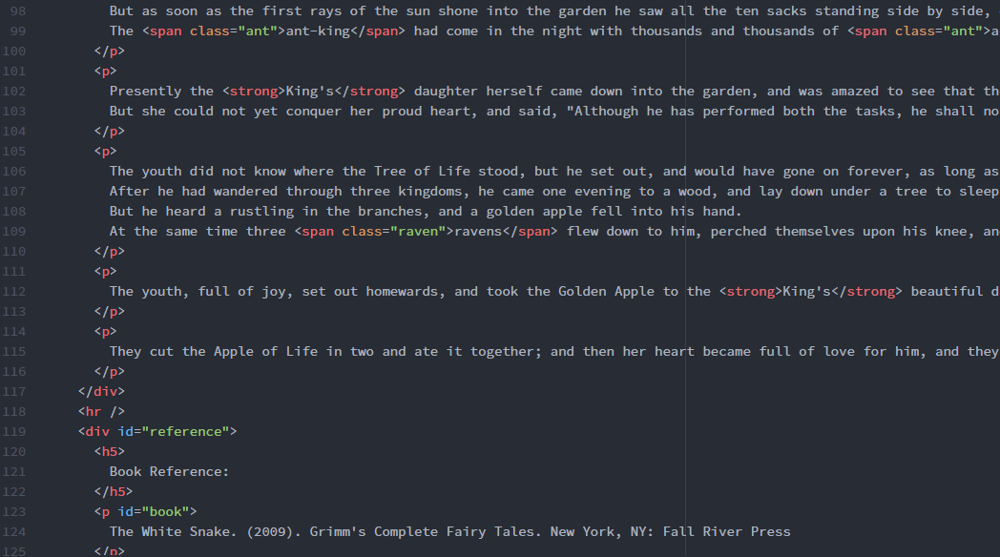
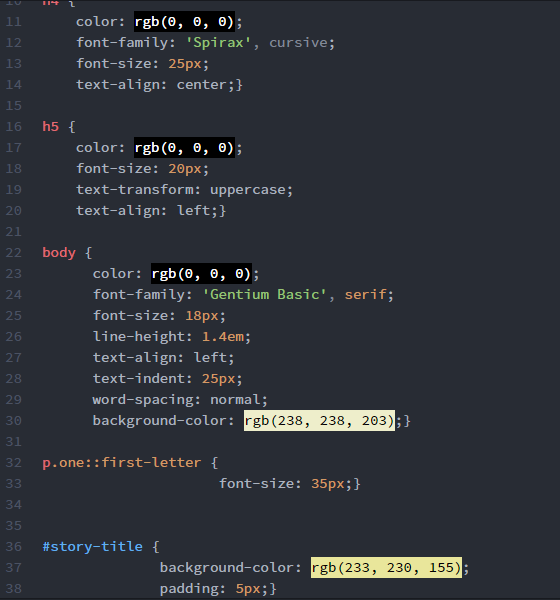

Olivia Coleman 51

# `Week Eight Assignment`

## 1. Summary
* I created my index.html page first, then the style.css page. Then I added the images.
* I used a story from a book I got recently called "Grimm's Complete Fairy Tales"
* On the style sheet, I added color for the different animals in the story using the `` element. I chose the colors based on what color I pictured when I thought of the animal.
* I bolded the king and queen characters, and italicized the queen as well. I did this because I needed to use a `<strong>` element, and the royalty characters seemed fitting.
* I used the `line-height` styling element because my font seemed too condensed. I also increased the `font-size`.
* I used the `text-align` styling element to center the title and images.
* I used the `text-indent` styling element to indent the paragraphs of the story.
* I chose the background and heading colors as light yellows because it looks like storybook paper.
* Here are some examples of my `html` and `css` codes:

## 2. Trials and Triumphs
* I have been having some issues with Github not showing my pictures in markdown documents. I never had this issue before. My text editor shows the pictures just fine.
* I figured out installing the color picker on the text editor so that I don't have to link to a website.
* I hope I referenced the book correctly.

## 3. Going Forward
* I am looking forward to working more with style sheets. I would like to learn how to style an image.

## 4. Resources
* [White Snake Picture](http://hqhd3d.blogspot.com/2013/04/white-snake-wallpapers.html)
