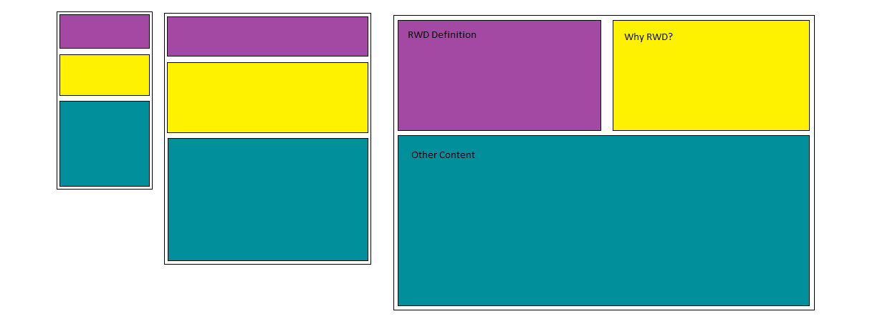

Olivia Coleman 51

# `Week Ten Assignment`

## 1. Summary
* This week's website is a basic explanation about what responsive web design is and why it is useful.
* The primary content is the description of RWD and why we should utilize RWD.
* The secondary content talks a little bit about the main elements of RWD and gives some useful links to help explain.
* The first things that should draw the eye to them would be the colors and the picture.
* I started by creating a layout for the website and chose a color scheme.
* I then created the files and folders, and chose some fonts.
* I designed the layout so that on a phone or tablet, the boxes would stack, but on a computer, there would be two boxes on top, and the larger box on the bottom with the scroll bar.

## 2. Trials and Triumphs
* I would recommend for anyone using Firefox as a browser to download the Web Developer extension. You can view the web page in Responsive Design Mode, and view the screen width. You can also toggle the width to see how the website changes.
* This week's information was hard for me to fully understand everything. I found it hard to talk about RWD because I do not fully understand it myself. It is hard for me to explain. Some subjects I understood, others I do not.
* It took me a while to figure out how to make the image resize with the device-width.
* It was pretty cool to see the site work on my iphone.

## 3. Going Forward
* I am super nervous about creating my final website. I am worried about how much time we will get to create it.

## 4. Resources
* [Content Fluidity Image](https://en.wikipedia.org/wiki/Responsive_web_design)
