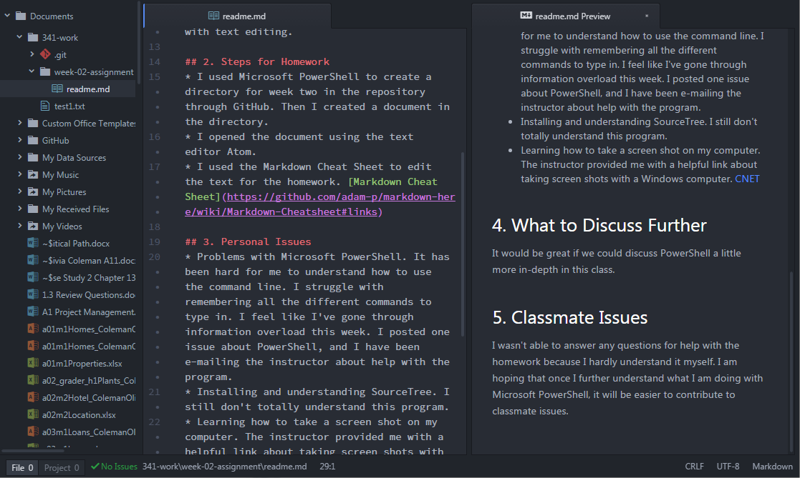

Olivia Coleman 51

# `Week Two Assignment`

## 1. Summary
* I followed the Week-2 section on our course webpage. I watched the videos posted for creating the text files.
* I installed the programs suggested.
* I spent a lot of time e-mailing the instructor.
* I synced Microsoft PowerShell with GitHub.
* I worked with Microsoft PowerShell to learn how to create the 341-work folder, directories, and text files.
* I worked with the text editor Atom to create a text file.
* I read the Markdown Cheat Sheet for help with text editing.

## 2. Steps for Homework
* I used Microsoft PowerShell to create a directory for week two in the repository through GitHub. Then I created a document in the directory.
* I opened the document using the text editor Atom.
* I used the Markdown Cheat Sheet to edit the text for the homework. [Markdown Cheat Sheet](https://github.com/adam-p/markdown-here/wiki/Markdown-Cheatsheet#links)

## 3. Personal Issues
* Problems with Microsoft PowerShell. It has been hard for me to understand how to use the command line. I struggle with remembering all the different commands to type in. I feel like I've gone through information overload this week. I posted one issue about PowerShell, and I have been e-mailing the instructor about help with the program.
* Installing and understanding SourceTree. I still don't totally understand this program.
* Learning how to take a screen shot on my computer. The instructor provided me with a helpful link about taking screen shots with a Windows computer. [CNET](https://www.cnet.com/how-to/how-to-take-a-screenshot-in-any-version-of-windows/)

## 4. What to Discuss Further
It would be great if we could discuss PowerShell a little more in-depth in this class.

## 5. Classmate Issues
I wasn't able to answer any questions for help with the homework because I hardly understand it myself. I am hoping that once I further understand what I am doing with Microsoft PowerShell, it will be easier to contribute to classmate issues.

<dl>
  <dt>`Inline Code`</dt>
  <dd>Am I doing this right?</dd>
</dl>
